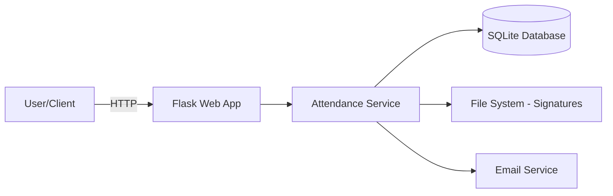
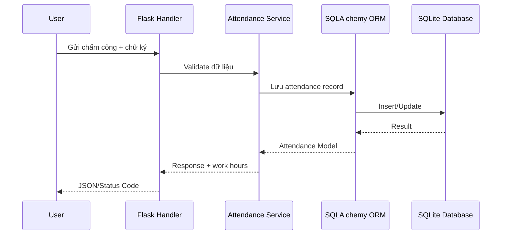

# Hệ thống Quản lý Chấm công DMI

> Hệ thống quản lý chấm công thông minh với tính năng đa vai trò, chữ ký số và báo cáo chi tiết
>
> **Phiên bản**: 2.0 - Đã được refactor và tối ưu hóa toàn diện
> **Mục tiêu**: Dễ đọc hiểu, dễ bảo trì, dễ mở rộng tính năng. Tài liệu này được viết theo tiêu chí *developer-first*.

---

## Mục lục

* [Bối cảnh & Phạm vi](#bối-cảnh--phạm-vi)
* [Kiến trúc tổng quan](#kiến-trúc-tổng-quan)
* [Ngăn xếp công nghệ](#ngăn-xếp-công-nghệ)
* [Tính năng chính & Logic xử lý](#tính-năng-chính--logic-xử-lý)
  * [1) Xác thực & Phân quyền](#1-xác-thực--phân-quyền-authentication--authorization)
  * [2) Chấm công hàng ngày](#2-chấm-công-hàng-ngày-daily-attendance-recording)
  * [3) Tính toán giờ công và tăng ca](#3-tính-toán-giờ-công-và-tăng-ca-work-hours--overtime-calculation)
  * [4) Phê duyệt chấm công](#4-phê-duyệt-chấm-công-attendance-approval)
  * [5) Báo cáo và xuất dữ liệu](#5-báo-cáo-và-xuất-dữ-liệu-reporting--export)
  * [6) Quản lý nghỉ phép](#6-quản-lý-nghỉ-phép-leave-management)
  * [7) Quản lý người dùng](#7-quản-lý-người-dùng-user-management)
  * [8) Hệ thống chữ ký số](#8-hệ-thống-chữ-ký-số-digital-signature-system)
  * [9) Audit Logging](#9-audit-logging-ghi-log-kiểm-toán)
  * [10) Email Notifications](#10-email-notifications)
  * [11) Performance & Optimization](#11-performance--optimization)
* [Cấu trúc thư mục](#cấu-trúc-thư-mục)
* [Yêu cầu hệ thống](#yêu-cầu-hệ-thống)
* [Cài đặt & Khởi chạy](#cài-đặt--khởi-chạy)
* [Cấu hình & Biến môi trường](#cấu-hình--biến-môi-trường)
* [Cơ sở dữ liệu & Migration](#cơ-sở-dữ-liệu--migration)
* [API & Hợp đồng](#api--hợp-đồng)
* [Thông báo Email: Kiến trúc & Polling](#thông-báo-email-kiến-trúc--polling)
* [Xử lý lỗi, Logging & Giám sát](#xử-lý-lỗi-logging--giám-sát)
* [Bảo mật](#bảo-mật)
* [Hiệu năng & Tối ưu](#hiệu-năng--tối-ưu)
* [Kiểm thử](#kiểm-thử)
* [Chất lượng mã & Quy ước](#chất-lượng-mã--quy-ước)
* [CI/CD & Release](#cicd--release)
* [Cách thêm tính năng mới](#cách-thêm-tính-năng-mới)
* [Khắc phục sự cố (Troubleshooting)](#khắc-phục-sự-cố-troubleshooting)
* [Lộ trình (Roadmap)](#lộ-trình-roadmap)
* [Giấy phép](#giấy-phép)
* [Phụ lục](#phụ-lục)

---

## Bối cảnh & Phạm vi

* **Bài toán**: Quản lý chấm công cho doanh nghiệp với nhiều ca làm việc, tính toán giờ công và tăng ca theo quy định phức tạp
* **Đối tượng sử dụng**: Nhân viên, Trưởng nhóm, Quản lý, Quản trị viên
* **Phạm vi**: 
  - Chấm công hàng ngày với chữ ký số
  - Tính toán giờ công và tăng ca theo loại ngày (thường/lễ/cuối tuần)
  - Phê duyệt chấm công theo phân quyền (3 cấp: Team Leader → Manager → Admin)
  - Báo cáo và xuất dữ liệu
  - Quản lý người dùng và phòng ban
  - Đăng ký và quản lý nghỉ phép với giao diện tối ưu
  - **MỚI**: Đổi mật khẩu trong phần Cài đặt
  - **MỚI**: UI/UX thống nhất và chuyên nghiệp
  - **MỚI**: Logic phê duyệt nghỉ phép đồng bộ với chấm công
* **Ngoài phạm vi**: Tích hợp với hệ thống lương

## Kiến trúc tổng quan

Hệ thống được xây dựng theo mô hình MVC với Flask, sử dụng SQLAlchemy ORM và SQLite database.



**Luồng chấm công**:



## Ngăn xếp công nghệ

* **Ngôn ngữ**: Python 3.8+
* **Framework**: Flask 2.3+
* **DB**: SQLite 3
* **ORM**: SQLAlchemy 2.0+
* **Template Engine**: Jinja2
* **Authentication**: Flask-Login, Session-based
* **File Upload**: Werkzeug
* **PDF Generation**: ReportLab
* **Email**: smtplib
* **Test**: pytest
* **Lint/Format**: ruff, black
* **Packaging**: pip
* **Container**: Docker (tùy chọn)

## Tính năng chính & Logic xử lý

### 1) Xác thực & Phân quyền (Authentication & Authorization)

#### **Đầu vào**
- `employee_id`: Mã nhân viên (format: chuỗi, không rỗng)
- `password`: Mật khẩu (độ dài tối thiểu 6 ký tự)

#### **Xử lý chi tiết**
1. **Input Validation**:
   - Kiểm tra `employee_id` không rỗng và đúng format
   - Kiểm tra `password` có độ dài hợp lệ
   - Sanitize input để tránh injection

2. **User Lookup**:
   - Tra cứu user trong database theo `employee_id`
   - Kiểm tra tài khoản có `is_active = True` không
   - Kiểm tra tài khoản có bị khóa (`is_deleted = False`) không

3. **Password Verification**:
   - So sánh password hash với `werkzeug.security.check_password_hash()`
   - Sử dụng bcrypt algorithm cho bảo mật

4. **Session Creation**:
   - Tạo session với `user_id`, `roles`, `name`, `employee_id`
   - Set session timeout (mặc định 8 giờ)
   - Ghi log đăng nhập thành công

5. **Rate Limiting**:
   - Giới hạn 100 lần đăng nhập/5 phút theo IP
   - Block IP nếu vượt quá giới hạn

#### **Đầu ra**
- **Thành công**: Redirect đến dashboard với session cookie
- **Thất bại**: Error message với HTTP status code

#### **Lỗi & Ngoại lệ**
- `401 Unauthorized`: Sai thông tin đăng nhập
- `429 Too Many Requests`: Vượt rate limit
- `403 Forbidden`: Tài khoản bị khóa
- `500 Internal Server Error`: Lỗi database

#### **Bảo mật**
- Password được hash với bcrypt
- Session timeout tự động
- CSRF protection cho tất cả forms
- Rate limiting theo IP
- Audit log cho mọi lần đăng nhập

#### **Edge Cases**
- Tài khoản bị khóa sau nhiều lần đăng nhập sai
- Session hết hạn giữa chừng
- Đăng nhập từ nhiều thiết bị khác nhau
- IP thay đổi trong session

---

### 2) Chấm công hàng ngày (Daily Attendance Recording)

#### **Đầu vào**
```json
{
  "date": "2024-01-15",
  "check_in": "08:00",
  "check_out": "17:30",
  "shift_code": "1",
  "break_time": "01:00",            // [MỚI] gửi dạng HH:MM
  "comp_time_regular": "00:00",     // [MỚI] gửi dạng HH:MM
  "comp_time_ot_before_22": "00:00",// [MỚI] gửi dạng HH:MM
  "comp_time_ot_after_22": "00:00", // [MỚI] gửi dạng HH:MM
  "holiday_type": "normal",
  "note": "Ghi chú tùy chọn",
  "signature": "base64_encoded_signature"
}
```

> [MỚI] Chuẩn thời lượng: Tất cả trường thời lượng (`break_time`, `comp_time_*`) nhận và hiển thị dạng HH:MM. Backend chuẩn hoá và tính toán nội bộ theo PHÚT (số nguyên), chỉ quy đổi ra giờ khi cần hiển thị để tránh sai số số thực.

#### **Xử lý chi tiết**

1. **Input Validation**:
   - Validate date format và không cho phép ngày tương lai
   - Validate time format (HH:MM)
   - Kiểm tra `check_out > check_in`
   - Validate `shift_code` (1-5)
   - [MỚI] Validate các thời lượng dạng `HH:MM` (tự parse về giờ trên backend, giới hạn 0-8h mỗi loại)

2. **Duplicate Check**:
   - Kiểm tra đã chấm công cho ngày này chưa
   - Nếu có, chỉ cho phép update nếu status = 'rejected'

3. **Holiday Type Detection**:
   - `normal`: Ngày làm việc bình thường
   - `weekend`: Cuối tuần
   - `vietnamese_holiday`: Lễ Việt Nam
   - `japanese_holiday`: Lễ Nhật

4. **Work Hours Calculation**:
   - Gọi `update_work_hours()` để tính toán chi tiết
   - Tính `total_work_hours`, `regular_work_hours`
   - Tính `overtime_before_22`, `overtime_after_22`

5. **Signature Processing**:
   - Validate signature format (base64)
   - Mã hóa signature trước khi lưu
   - Lưu vào database với encryption

6. **Database Transaction**:
   - Tạo attendance record với status = 'pending'
   - Lưu tất cả thông tin vào database
   - Commit transaction

#### **Đầu ra**
```json
{
  "message": "Chấm công thành công",
  "work_hours": 8.5,
  "overtime_before_22": "0:30",
  "overtime_after_22": "0:00",
  "signature_info": {
    "has_signature": true,
    "signature_type": "manual"
  }
}
```

#### **Lỗi & Ngoại lệ**
- `400 Bad Request`: Dữ liệu không hợp lệ
- `409 Conflict`: Đã chấm công cho ngày này
- `401 Unauthorized`: Chưa đăng nhập
- `500 Internal Server Error`: Lỗi database

#### **Bảo mật**
- Validate tất cả input
- Mã hóa signature
- Kiểm tra quyền truy cập
- CSRF protection

#### **Edge Cases**
- Tăng ca qua ngày (next_day_checkout = true)
- Ca làm việc qua đêm
- Ngày lễ đặc biệt
- Chữ ký không hợp lệ

---

### 3) Tính toán giờ công và tăng ca (Work Hours & Overtime Calculation)

> [MỚI] Nguyên tắc làm tròn & độ chính xác
>
>- Nội bộ dùng PHÚT (int) cho tất cả phép tính: trừ giờ nghỉ, đối ứng, phân bổ OT trước/sau 22h.
>- Khi cần hiển thị, hệ thống chuyển phút → HH:MM. Tổng giờ dạng số (ví dụ `total_work_hours`) được tính từ phút và làm tròn tới 2 chữ số thập phân sau giờ (phục vụ các báo cáo tổng hợp), nhưng UI chính vẫn dùng HH:MM.
>- Khi nhận giá trị HH:MM, việc chia/multiplying 60 có thể tạo số thực nhị phân, nhưng hệ thống luôn dùng `int(round(x*60))` để bảo toàn phút, do đó không mất/thiếu phút khi chuyển đổi.

#### **Logic phức tạp theo loại ngày**

##### **A. Ngày thường (normal)**

**Giờ công thường (regular_work_hours)**:
- Tối đa 8 giờ
- Tính trong khoảng thời gian ca làm việc
- Trừ thời gian nghỉ và đối ứng trong ca

**Tăng ca trước 22h (overtime_before_22)**:
- **Ca 1-4**: Chỉ tính về muộn (sau giờ ra ca nhưng trước 22h)
- **Ca 5 (tự do)**: Tính cả đi làm sớm + về muộn

**Tăng ca sau 22h (overtime_after_22)**:
- Từ 22:00 đến giờ ra
- Tính cả trường hợp qua đêm

**Ví dụ cụ thể**:
```
Ca 1 (8:00-17:00):
- Làm việc: 7:30 - 18:30
- Giờ công thường: 8h (8:00-17:00, trừ 1h nghỉ)
- Tăng ca trước 22h: 1h (17:00-18:00) - KHÔNG tính 7:30-8:00
- Tăng ca sau 22h: 0h

Ca 5 (tự do):
- Làm việc: 7:30 - 18:30  
- Giờ công thường: 8h
- Tăng ca trước 22h: 1.5h (7:30-8:00 + 17:00-18:00)
- Tăng ca sau 22h: 0h
```

##### **B. Ngày lễ Việt Nam (vietnamese_holiday)**

**Giờ công thường**: 8 giờ (ngày nghỉ có lương)

**Nguyên tắc tổng quát**:
- Tất cả giờ làm trong ngày đều là tăng ca (8h giờ công chính thức được cấp miễn phí)

**Tăng ca trước 22h**:
- Từ giờ vào đến 22:00 (trừ thời gian nghỉ)

**Tăng ca sau 22h**:
- Từ 22:00 đến giờ ra

**Đối ứng (Comp Time)**:
- **KHÔNG áp dụng** đối ứng trong ca (`comp_time_regular`) và đối ứng tăng ca tổng (`comp_time_overtime`)
- **CHỈ áp dụng** đối ứng tăng ca chi tiết: `comp_time_ot_before_22`, `comp_time_ot_after_22` (trừ trực tiếp vào từng phần OT tương ứng)

##### **C. Cuối tuần (weekend)**

**Giờ công thường**: 0 giờ (ngày nghỉ không lương)

**Tăng ca trước 22h**:
- Từ giờ vào đến **min(22:00, giờ ra)** (giới hạn bởi thời gian làm việc thực tế)
- **Trừ thời gian nghỉ ngay từ đầu** (không trừ 2 lần)
- **Quan trọng**: Tăng ca trước 22h không được vượt quá tổng giờ làm thực tế

**Tăng ca sau 22h**:
- Từ 22:00 đến giờ ra

**Ví dụ cụ thể**:
```
Cuối tuần: 07:30 - 19:30, nghỉ 1h
- Giờ công thường: 0h (cuối tuần)
- Tổng giờ làm: 12h - 1h nghỉ = 11h
- Tăng ca trước 22h: min(22:00, 19:30) - 07:30 - 1h = 19:30 - 07:30 - 1h = 11h ✅
- Tăng ca sau 22h: 0h (không có)
```

##### **D. Lễ Nhật (japanese_holiday)**

**Giờ công thường**: Tối đa 8 giờ
- **Giờ công = total_work_hours** (đã trừ giờ nghỉ), trừ **tất cả loại đối ứng**
- **Giới hạn tối đa 8h** cho giờ công thường
- **Hỗ trợ chọn nhiều loại đối ứng**: `comp_time_regular`, `comp_time_overtime`, `comp_time_ot_before_22`, `comp_time_ot_after_22`

**Tăng ca**: Tổng giờ làm - giờ công thường
- Phân bổ ưu tiên phần sau 22h trước

#### **Compensation Time Logic**

**Các loại đối ứng**:
1. `comp_time_regular`: Đối ứng trong ca
2. `comp_time_ot_before_22`: Đối ứng tăng ca trước 22h
3. `comp_time_ot_after_22`: Đối ứng tăng ca sau 22h
4. `comp_time_overtime`: Đối ứng tăng ca tổng (legacy)

**Quy tắc**:
- **Có thể chọn nhiều loại đối ứng cùng lúc** (linh hoạt hơn)
- Đối ứng không được vượt quá thời gian thực tế
- **Đối ứng trong ca**: trừ vào `regular_work_hours` và `total_work_hours`
- **Đối ứng tăng ca trước 22h**: trừ vào `overtime_before_22` và `total_work_hours`
- **Đối ứng tăng ca sau 22h**: trừ vào `overtime_after_22` và `total_work_hours`
- **Đối ứng tăng ca tổng (legacy)**: trừ vào tổng tăng ca và `total_work_hours`
- **Tổng đối ứng**: Tất cả loại đối ứng được cộng lại và trừ vào `total_work_hours`
- **Validation**: Tổng đối ứng không được vượt quá tổng giờ làm thực tế (đã trừ giờ nghỉ)
- **Hiển thị**: Cột "Đối ứng" trong bảng hiển thị tổng thời gian của tất cả các loại đối ứng được chọn

**Quy tắc enable/disable đối ứng mới**:
1. **< 8h**: Chỉ cho phép `comp_time_regular` (đối ứng trong ca)
2. **≥ 8h và có tăng ca < 22h**: Chỉ cho phép `comp_time_regular` và `comp_time_ot_before_22`
3. **≥ 8h và có tăng ca ≥ 22h**: Cho phép tất cả loại đối ứng
4. **Cuối tuần/Lễ VN**: Chỉ cho phép đối ứng tăng ca (không có đối ứng trong ca)

**Đặc biệt cho cuối tuần**:
- **KHÔNG áp dụng** đối ứng trong ca (`comp_time_regular`, `comp_time_overtime`)
- **CHỈ áp dụng** đối ứng tăng ca (`comp_time_ot_before_22`, `comp_time_ot_after_22`)
- **Lý do**: Cuối tuần không có giờ công thường, chỉ có tăng ca

#### **Validation Logic**

```python
# Kiểm tra có tăng ca không
has_overtime = overtime_before_22_hours > 0.1 or overtime_after_22_hours > 0.1

# Nếu không có tăng ca: chỉ cho phép đối ứng trong ca
if not has_overtime:
    if comp_time_ot_before_22 > 0 or comp_time_ot_after_22 > 0:
        return "Không có tăng ca, chỉ được đối ứng trong ca"

# Kiểm tra không vượt quá thực tế
if comp_time_ot_before_22 > overtime_before_22_hours:
    return "Đối ứng trước 22h vượt quá thực tế"
```

---

### 4) Phê duyệt chấm công (Attendance Approval)

#### **Phân quyền chi tiết**

**Hierarchy**: `EMPLOYEE < TEAM_LEADER < MANAGER < ADMIN`

**Quyền phê duyệt**:
- **ADMIN**: Phê duyệt tất cả, không cần chữ ký
- **MANAGER**: Phê duyệt nhân viên cùng phòng ban
- **TEAM_LEADER**: Phê duyệt nhân viên cùng phòng ban
- **EMPLOYEE**: Chỉ xem bản ghi của mình

#### **Đầu vào**
```json
{
  "action": "approve", // hoặc "reject"
  "signature": "base64_encoded_signature", // tùy chọn
  "note": "Ghi chú phê duyệt" // tùy chọn
}
```

#### **Xử lý chi tiết**

1. **Permission Check**:
   - Kiểm tra user có quyền phê duyệt attendance này không
   - Validate role hierarchy
   - Kiểm tra cùng phòng ban (nếu cần)

2. **Signature Validation** (nếu không phải ADMIN):
   - Kiểm tra có chữ ký hợp lệ không
   - Validate signature format và encryption
   - Kiểm tra signature không quá cũ

3. **Status Update**:
   - Cập nhật `status` = 'approved' hoặc 'rejected'
   - Lưu `approved_by`, `approved_at`
   - Lưu chữ ký người phê duyệt (nếu có)

4. **Notification**:
   - Gửi email thông báo cho nhân viên
   - Ghi audit log chi tiết

#### **Smart Signature System**

**Logic chữ ký thông minh**:
1. Kiểm tra session có chữ ký không
2. Nếu có, hỏi dùng lại
3. Kiểm tra database có chữ ký cũ không
4. Nếu có, đề xuất tái sử dụng
5. Nếu không, yêu cầu ký mới

**API Endpoints**:
- `POST /api/signature/check`: Kiểm tra trạng thái chữ ký
- `POST /api/signature/save-session`: Lưu chữ ký vào session
- `POST /api/signature/clear-session`: Xóa chữ ký khỏi session

#### **Đầu ra**
```json
{
  "message": "Phê duyệt thành công",
  "attendance_id": 123,
  "status": "approved",
  "approved_by": "user_name",
  "approved_at": "2024-01-15T10:30:00"
}
```

#### **Tính năng mở trình duyệt tự động với Selenium**
- **Khi ADMIN phê duyệt**: Tự động mở Chrome với Selenium để tương tác với Google Drive
- **URL**: `https://drive.google.com/drive/folders/1dHF_x6fCJEs9krtmaZPabBIWiTr5xpB3`
- **Công nghệ**: Selenium WebDriver + Chrome
- **Tính năng**: 
  - Tự động điều hướng đến folder
  - Tương tác với elements (click, scroll, đếm files)
  - Error handling: Thông báo lỗi rõ ràng khi Selenium không thể hoạt động
- **Dependencies**: `selenium==4.15.2`, `webdriver-manager==4.0.1`

#### **Lỗi & Ngoại lệ**
- `403 Forbidden`: Không có quyền phê duyệt
- `400 Bad Request`: Thiếu chữ ký (nếu cần)
- `404 Not Found`: Không tìm thấy attendance
- `409 Conflict`: Đã được phê duyệt rồi

#### **Bảo mật**
- Role-based access control
- Signature encryption
- Audit logging
- Session timeout cho chữ ký

---

### 5) Báo cáo và xuất dữ liệu (Reporting & Export)

#### **Các loại báo cáo**

##### **A. Báo cáo chấm công**
- **Theo ngày**: Tổng hợp chấm công trong ngày
- **Theo tuần**: Thống kê tuần làm việc
- **Theo tháng**: Báo cáo tháng chi tiết
- **Theo quý**: Tổng hợp quý

##### **B. Báo cáo tăng ca**
- Tăng ca theo từng nhân viên
- Tăng ca theo phòng ban
- Tăng ca theo loại ngày
- So sánh tăng ca các tháng

##### **C. Báo cáo phê duyệt**
- Thời gian phê duyệt trung bình
- Tỷ lệ phê duyệt/từ chối
- Người phê duyệt nhiều nhất

#### **Filter Options**
```json
{
  "date_from": "2024-01-01",
  "date_to": "2024-01-31",
  "department": "IT",
  "user_id": 123,
  "status": "approved",
  "holiday_type": "normal"
}
```

#### **Xuất dữ liệu**

##### **A. PDF Export**
- **Công nghệ**: ReportLab
- **Nội dung**: 
  - Thông tin nhân viên
  - Bảng chấm công chi tiết
  - Tổng hợp giờ công và tăng ca
  - Chữ ký số (nếu có)
- **Format**: A4, song ngữ (Việt-Anh)

##### **B. Excel Export**
- **Format**: CSV
- **Encoding**: UTF-8
- **Nội dung**: Dữ liệu thô để phân tích

##### **C. Bulk Export**
- **ZIP nhiều PDF**: Xuất hàng loạt cho nhiều nhân viên
- **Batch processing**: Xử lý theo lô để tránh timeout

#### **Performance Optimization**
- **Pagination**: Giới hạn 100 records/page
- **Caching**: Cache kết quả báo cáo 5 phút
- **Background processing**: Xuất file lớn trong background
- **Database indexing**: Index cho các cột filter

#### **Đầu ra**
```json
{
  "report_data": {
    "total_records": 150,
    "total_work_hours": 1200,
    "total_overtime": 45.5,
    "approval_rate": 95.2
  },
  "export_url": "/download/report_202401.pdf",
  "generated_at": "2024-01-15T10:30:00"
}
```

---

### 6) Quản lý nghỉ phép (Leave Management)

#### **Tính năng chính**
- **Đăng ký nghỉ phép**: Form đăng ký với giao diện thân thiện
- **Phân loại nghỉ phép**: Nghỉ phép năm, nghỉ không lương, nghỉ đặc biệt
- **Upload chứng từ**: Hỗ trợ PDF, JPG, PNG, DOC, DOCX (tối đa 10MB)
- **Quản lý người thay thế**: Thông tin người đảm trách công việc
- **Phê duyệt đơn nghỉ**: Workflow phê duyệt theo phân quyền

#### **Giao diện tối ưu**
- **Layout cân đối**: 4 cột cho các trường số ngày nghỉ
- **Responsive design**: Tương thích mọi thiết bị
- **Form validation**: Kiểm tra dữ liệu real-time
- **File preview**: Xem trước file đã upload
- **Sidebar navigation**: Menu điều hướng trực quan

#### **Các loại nghỉ phép**
1. **Nghỉ phép năm**: Nghỉ có lương theo quy định
2. **Nghỉ không lương**: Nghỉ không tính lương
3. **Nghỉ đặc biệt**: Nghỉ cho các sự kiện đặc biệt (kết hôn, tang lễ, sinh con)

#### **Workflow phê duyệt**
- **EMPLOYEE**: Tạo đơn nghỉ phép
- **TEAM_LEADER**: Phê duyệt đơn của nhân viên cùng phòng ban
- **MANAGER**: Phê duyệt đơn của toàn phòng ban
- **ADMIN**: Phê duyệt tất cả đơn nghỉ

#### **Tính năng nâng cao**
- **Chứng từ đính kèm**: Upload và quản lý file chứng minh
- **Ghi chú chi tiết**: Mô tả lý do nghỉ phép
- **Thông tin thay thế**: Người đảm trách công việc trong thời gian nghỉ
- **Lịch sử đơn nghỉ**: Theo dõi trạng thái và lịch sử phê duyệt

---

### 7) Quản lý người dùng (User Management)

#### **CRUD Operations**

##### **A. Tạo người dùng**
```json
{
  "name": "Nguyễn Văn A",
  "employee_id": "NV001",
  "email": "nguyenvana@company.com",
  "department": "IT",
  "roles": "EMPLOYEE,TEAM_LEADER",
  "password": "secure_password"
}
```

##### **B. Cập nhật thông tin**
- Thông tin cá nhân
- Phân quyền
- Trạng thái tài khoản

##### **C. Xóa mềm (Soft Delete)**
- Set `is_deleted = True`
- Không xóa dữ liệu thực
- Ẩn khỏi danh sách

#### **Phân quyền chi tiết**

**EMPLOYEE**:
- Xem và chấm công của mình
- Cập nhật thông tin cá nhân

**TEAM_LEADER**:
- Tất cả quyền của EMPLOYEE
- Phê duyệt nhân viên cùng phòng ban
- Xem báo cáo phòng ban

**MANAGER**:
- Tất cả quyền của TEAM_LEADER
- Quản lý nhân viên trong phòng ban
- Báo cáo toàn phòng ban

**ADMIN**:
- Tất cả quyền
- Quản lý toàn bộ hệ thống
- Cấu hình hệ thống

#### **Security Features**
- Password complexity validation
- Account lockout sau nhiều lần đăng nhập sai
- Session management
- Audit logging cho mọi thay đổi

---

### 8) Hệ thống chữ ký số (Digital Signature System)

#### **Signature Types**
1. **Manual Signature**: Ký tay trên web
2. **Database Signature**: Chữ ký đã lưu trước đó
3. **Session Signature**: Chữ ký trong session hiện tại

#### **Signature Lifecycle**
1. **Creation**: User ký trên SignaturePad
2. **Encryption**: Mã hóa với Fernet (AES-128)
3. **Storage**: Lưu vào database hoặc session
4. **Validation**: Kiểm tra khi sử dụng
5. **Expiration**: Tự động hết hạn sau 30 phút

#### **Smart Reuse Logic**
```python
def get_signature_status(user_id, role):
    # 1. Kiểm tra session signature
    if session_signature_exists():
        return "session_available"
    
    # 2. Kiểm tra database signature
    if db_signature_exists(user_id, role):
        return "database_available"
    
    # 3. Kiểm tra signature từ role thấp hơn
    if lower_role_signature_exists(user_id):
        return "lower_role_available"
    
    return "no_signature"
```

#### **Security Measures**
- **Encryption**: Tất cả chữ ký được mã hóa
- **Session Timeout**: 30 phút tự động hết hạn
- **Role-based Access**: Chỉ dùng chữ ký của chính mình
- **Audit Logging**: Ghi log mọi thao tác chữ ký

---

### 9) Audit Logging (Ghi log kiểm toán)

#### **Logged Actions**
- Đăng nhập/đăng xuất
- Tạo/cập nhật/xóa attendance
- Phê duyệt/từ chối
- Thay đổi thông tin user
- Sử dụng chữ ký

#### **Log Data Structure**
```json
{
  "user_id": 123,
  "action": "APPROVE_ATTENDANCE",
  "table_name": "attendances",
  "record_id": 456,
  "old_values": {"status": "pending"},
  "new_values": {"status": "approved"},
  "ip_address": "192.168.1.100",
  "user_agent": "Mozilla/5.0...",
  "created_at": "2024-01-15T10:30:00"
}
```

#### **Audit Features**
- **Immutable Logs**: Không thể sửa/xóa
- **Search & Filter**: Tìm kiếm theo nhiều tiêu chí
- **Export**: Xuất log để phân tích
- **Retention**: Lưu trữ theo policy

---

### 10) Email Notifications

#### **Notification Types**
1. **Approval Notification**: Thông báo khi được phê duyệt
2. **Rejection Notification**: Thông báo khi bị từ chối
3. **Password Reset**: Link reset mật khẩu
4. **System Alerts**: Cảnh báo hệ thống

#### **Email Templates**
- **HTML Format**: Template đẹp, responsive
- **Multi-language**: Hỗ trợ tiếng Việt và tiếng Anh
- **Dynamic Content**: Thông tin động từ database

#### **SMTP Configuration**
```python
MAIL_SERVER = 'smtp.gmail.com'
MAIL_PORT = 587
MAIL_USE_TLS = True
MAIL_USERNAME = 'noreply@company.com'
MAIL_PASSWORD = 'app_password'
```

---

### 11) Performance & Optimization

#### **Database Optimization**
- **Indexing**: Index cho các cột thường query
- **Query Optimization**: Sử dụng SQLAlchemy efficiently
- **Connection Pooling**: Quản lý connection database
- **Caching**: Cache dữ liệu tĩnh

#### **Frontend Optimization**
- **Lazy Loading**: Load dữ liệu theo nhu cầu
- **Pagination**: Phân trang cho danh sách dài
- **Compression**: Nén CSS/JS
- **CDN**: Sử dụng CDN cho static files

#### **Background Processing**
- **PDF Generation**: Xử lý trong background
- **Email Sending**: Queue email để gửi
- **Data Export**: Export file lớn trong background
- **Cleanup Tasks**: Dọn dẹp dữ liệu cũ

## Cấu trúc thư mục

```text
.
├─ app.py                 # Main Flask application
├─ config.py              # Configuration classes
├─ database/
│  ├─ models.py           # SQLAlchemy models
│  ├─ schema-sqlite.sql   # Database schema
│  └─ migrations/         # Database migrations
├─ utils/
│  ├─ validators.py       # Input validation
│  ├─ session.py          # Session management
│  ├─ decorators.py       # Custom decorators
│  └─ signature_manager.py # Digital signature handling
├─ templates/             # Jinja2 templates
├─ static/                # CSS, JS, images
├─ seeds/                 # Database seeding scripts
├─ scripts/               # Utility scripts
├─ requirements.txt       # Python dependencies
├─ .env.example           # Environment variables template
└─ README.md
```

## Yêu cầu hệ thống

* Python 3.8+
* SQLite 3
* 512MB RAM (minimum)
* 1GB disk space

## Cài đặt & Khởi chạy

### 1) Cài đặt nhanh

```bash
# 1) Clone repository
git clone https://github.com/ncdathwb/attendances-final-management-system-dmi.git
cd attendances-final-management-system-dmi

# 2) Tạo virtual environment
python -m venv venv
source venv/bin/activate  # Linux/Mac
# hoặc
venv\Scripts\activate     # Windows

# 3) Cài đặt dependencies
pip install -r requirements.txt

# 4) Copy biến môi trường
cp .env.example .env

# 5) Khởi tạo database
python database/init_db.py

# 6) Tạo dữ liệu mẫu (tùy chọn)
python seeds/users.py
python seeds/attendance.py

# 7) Chạy ứng dụng
python app.py
```

### 2) Thông tin tài khoản demo

**Tài khoản Admin:**
- Mã nhân viên: `ADMIN001`
- Mật khẩu: `admin123`

**Tài khoản Manager:**
- Mã nhân viên: `MGR001`
- Mật khẩu: `manager123`

**Tài khoản Team Leader:**
- Mã nhân viên: `TL001`
- Mật khẩu: `leader123`

**Tài khoản Employee:**
- Mã nhân viên: `EMP001`
- Mật khẩu: `employee123`

### 3) Docker (tùy chọn)

```bash
docker build -t attendance-system .
docker run -p 5000:5000 attendance-system
```

## Cấu hình & Biến môi trường

| Biến                | Bắt buộc | Mặc định | Mô tả                                    |
| ------------------- | :------: | -------- | ---------------------------------------- |
| `FLASK_ENV`         |    ✔︎    | `development` | Môi trường chạy                          |
| `SECRET_KEY`        |    ✔︎    |          | Secret key cho Flask                     |
| `DATABASE_URL`      |          | `sqlite:///attendance.db` | Database connection string |
| `MAIL_SERVER`       |          |          | SMTP server cho email                    |
| `MAIL_PORT`         |          | `587`    | SMTP port                                |
| `MAIL_USERNAME`     |          |          | Email username                           |
| `MAIL_PASSWORD`     |          |          | Email password                           |
| `LOG_LEVEL`         |          | `INFO`   | Mức log                                  |

**`.env.example`**

```env
FLASK_ENV=development
SECRET_KEY=your-secret-key-here
DATABASE_URL=sqlite:///attendance.db
MAIL_SERVER=smtp.gmail.com
MAIL_PORT=587
MAIL_USERNAME=your-email@gmail.com
MAIL_PASSWORD=your-app-password
LOG_LEVEL=INFO
```

## Cơ sở dữ liệu & Migration

* **Quy ước**:
  * Khóa chính kiểu INTEGER AUTOINCREMENT
  * Timestamp kiểu `datetime`
  * **Soft delete**: cột `is_deleted` boolean
  * **Index** cho cột thường tra cứu (user_id, date, status)

* **Migration**: Manual SQL scripts
  * Tạo migration: Edit `database/schema-sqlite.sql`
  * Áp dụng: `python scripts/init_db.py`

## API & Hợp đồng

* **Chuẩn**: REST/JSON
* **Authentication**: Session-based
* **Error Response**:

```json
{
  "error": "Mô tả lỗi",
  "details": "Chi tiết bổ sung"
}
```

* **Success Response**:

```json
{
  "message": "Thành công",
  "data": {...}
}
```

---

## Thông báo Email: Kiến trúc & Polling

### Tổng quan
- Từ phiên bản này, trạng thái gửi email được lưu bền vững trong bảng `email_status_records` để tránh phụ thuộc vào bộ nhớ tiến trình (in‑memory) và đảm bảo mọi trang có thể hiển thị kết quả ngay cả khi không có `request_id` trên URL.
- Frontend sử dụng polling (yêu cầu GET định kỳ) để hỏi trạng thái. Đây là cách đơn giản, an toàn với session hiện tại.

### Bảng `email_status_records`
- Columns: `request_id` (unique, indexed), `status` (`sending|success|error`), `message`, `updated_at`.
- Được cập nhật:
  - Khi bắt đầu gửi: `sending` (đặt ngay khi submit/approve).
  - Khi gửi xong trong luồng bất đồng bộ: cập nhật `success|error`.

### API Endpoints liên quan
- `GET /api/email-status/<int:request_id>`: trả về trạng thái hiện thời của một request cụ thể. Ưu tiên đọc từ DB; fallback session nếu cần.
- `GET /api/email-status/latest`: trả trạng thái gần nhất của người dùng hiện tại từ session, tự đối chiếu DB nếu có `request_id` và đã hoàn tất.

### Vì sao có nhiều GET (polling) và ảnh hưởng gì?
- Polling mặc định mỗi 3s trong tối đa ~1 phút, chỉ là các JSON rất nhỏ → chi phí thấp, không ảnh hưởng đáng kể hiệu năng.
- Ưu điểm: đơn giản, tin cậy, không phụ thuộc WebSocket/SSE.
- Nếu cần giảm lưu lượng:
  - Tăng khoảng cách polling (ví dụ 5–10s).
  - Giảm `maxPolls` trên `static/js/global-email-notification.js`.
  - Hoặc chuyển sang SSE/WebSocket (tương lai) để push real‑time.

### Cách tắt hoặc tinh chỉnh
- Tắt hoàn toàn: không include `static/js/global-email-notification.js` trên trang.
- Tinh chỉnh: sửa các hằng số trong file JS: delay khởi tạo, interval polling, `maxPolls`.

## Xử lý lỗi, Logging & Giám sát

* **Logging**: Python logging module
* **Error Handling**: Global exception handlers
* **Audit Log**: Lưu trữ các thao tác quan trọng
* **Monitoring**: Basic health check endpoints

## Bảo mật

* Password hashing với werkzeug.security
* Session management an toàn
* CSRF protection
* Input validation và sanitization
* Rate limiting cho login
* File upload validation

## Hiệu năng & Tối ưu

* Database indexing cho queries thường dùng
* Pagination cho danh sách dài
* Caching cho dữ liệu tĩnh
* Optimized queries với SQLAlchemy

## Kiểm thử

```bash
# Chạy tất cả tests
pytest

# Chạy với coverage
pytest --cov=app

# Chạy specific test
pytest tests/test_attendance.py
```

* **Coverage** ≥ 80%
* **Test types**: Unit tests, Integration tests
* **Fixtures**: Sử dụng pytest fixtures

## Chất lượng mã & Quy ước

* **PEP8** compliance
* **Type hints** cho functions quan trọng
* **Docstrings** cho classes và methods
* **Tools**: `ruff`, `black`

```bash
# Format code
black .

# Lint code
ruff check .

# Type checking
mypy app.py
```

* **Commit** theo Conventional Commits
* **Branching**: Feature branches

## CI/CD & Release

* **CI**: Automated testing trên push
* **CD**: Manual deployment
* **Versioning**: Semantic versioning

## Cách thêm tính năng mới

1. Tạo feature branch
2. Thiết kế database schema (nếu cần)
3. Implement models và business logic
4. Thêm routes và templates
5. Viết tests
6. Update documentation
7. Create pull request

**Checklist PR**

* [ ] Có tests cho tính năng mới
* [ ] Database schema được update (nếu cần)
* [ ] Documentation được update
* [ ] Code được format và lint
* [ ] Không có security issues

## Khắc phục sự cố (Troubleshooting)

* **Database connection error**: Kiểm tra `DATABASE_URL`, file permissions
* **Import errors**: Kiểm tra virtual environment, dependencies
* **Template errors**: Kiểm tra Jinja2 syntax
* **Session issues**: Kiểm tra `SECRET_KEY`

## Cải tiến trong phiên bản 2.0

### ✅ Đã hoàn thành

* **UI/UX Thống nhất**: 
  - Cập nhật toàn bộ giao diện với màu sắc, font chữ, bố cục đồng nhất
  - Sử dụng CSS variables để dễ bảo trì
  - Responsive design cho mọi thiết bị
  - Toast notifications thống nhất

* **Logic Phê duyệt Nghỉ phép**:
  - Đồng bộ hoàn toàn với logic phê duyệt chấm công
  - Workflow 3 cấp: Team Leader → Manager → Admin
  - Xử lý chữ ký và phân quyền nhất quán

* **Tính năng Đổi mật khẩu**:
  - Thêm form đổi mật khẩu trong phần Cài đặt
  - Validation mật khẩu hiện tại và mới
  - Bảo mật với bcrypt hashing

* **Code Cleanup**:
  - Xóa toàn bộ comment và debug code không cần thiết
  - Xóa các file backup và test không dùng
  - Tối ưu hóa cấu trúc code

* **Performance & Security**:
  - Sửa lỗi cache function
  - Tối ưu hóa database queries
  - Cải thiện error handling

### 🔄 Đang phát triển

* [ ] Tích hợp với hệ thống lương
* [ ] Mobile app
* [ ] Real-time notifications
* [ ] Advanced reporting dashboard
* [ ] Multi-language support
* [ ] API for third-party integrations

## Giấy phép

MIT License — xem `LICENSE`.

## Phụ lục

* **Quy ước đặt tên**:
  * snake_case cho Python files và functions
  * PascalCase cho classes
  * SCREAMING_SNAKE_CASE cho constants
  * camelCase cho JavaScript

* **Database Schema**: Xem `database/schema-sqlite.sql`

* **API Documentation**: Xem inline comments trong `app.py`

---

> **Lưu ý**: Đây là hệ thống quản lý chấm công với logic tính toán phức tạp. Hãy đảm bảo test kỹ lưỡng trước khi deploy production.
