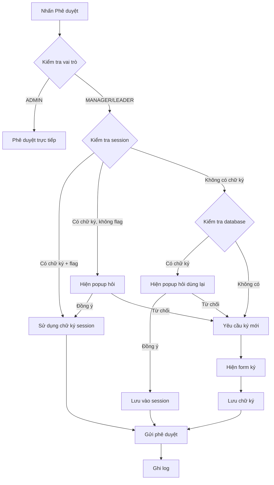
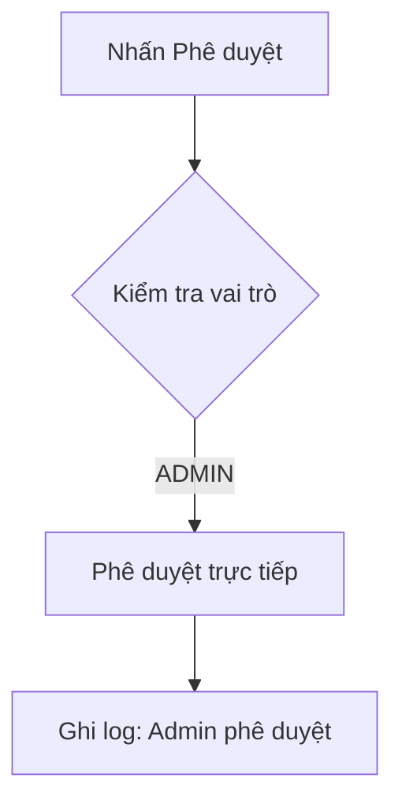

# Hệ Thống Chữ Ký Thông Minh (Smart Signature System)

## Tổng Quan

Hệ thống chữ ký thông minh được thiết kế để giảm thiểu thao tác lặp đi lặp lại khi phê duyệt yêu cầu, đồng thời đảm bảo tính xác thực và bảo mật cao.

## Tính Năng Chính

### 🔐 Bảo Mật
- **Mã hóa chữ ký**: Sử dụng Fernet (AES-128) để mã hóa chữ ký
- **Session timeout**: Chữ ký tự động hết hạn sau 30 phút
- **Audit logging**: Ghi log chi tiết mọi hành động chữ ký

### 🧠 Thông Minh
- **Tự động phát hiện**: Kiểm tra chữ ký trong session và database
- **Tái sử dụng thông minh**: Cho phép sử dụng lại chữ ký đã lưu
- **Tùy chọn "Không hỏi lại"**: Giảm thiểu popup không cần thiết

### 👥 Phân Quyền
- **Admin**: Không cần chữ ký, phê duyệt trực tiếp
- **Manager/Leader**: Yêu cầu chữ ký với logic thông minh
- **Employee**: Chỉ có thể ký cho bản ghi của mình

## Luồng Xử Lý

### 1. Luồng cho Trưởng nhóm/Quản lý



### 2. Luồng cho Admin



## Cấu Trúc Code

### Backend Components

#### 1. Signature Manager (`utils/signature_manager.py`)
```python
class SignatureManager:
    def encrypt_signature(self, signature_data: str) -> str
    def decrypt_signature(self, encrypted_signature: str) -> str
    def save_signature_to_session(self, user_id: int, role: str, signature: str, signature_type: str) -> bool
    def get_signature_from_session(self, user_id: int, role: str) -> Tuple[Optional[str], Optional[Dict]]
    def get_signature_from_database(self, user_id: int, role: str, attendance_id: int = None) -> Optional[str]
    def should_use_session_signature(self, user_id: int, role: str) -> bool
    def log_signature_action(self, user_id: int, action: str, signature_type: str, ...) -> None
```

#### 2. API Endpoints
- `POST /api/signature/check` - Kiểm tra trạng thái chữ ký
- `POST /api/signature/save-session` - Lưu chữ ký vào session
- `POST /api/signature/clear-session` - Xóa chữ ký khỏi session

#### 3. Updated Approval Logic
```python
@app.route('/api/attendance/<int:attendance_id>/approve', methods=['POST'])
def approve_attendance(attendance_id):
    # Kiểm tra vai trò
    if current_role == 'ADMIN':
        # Admin không cần chữ ký
        approver_signature = None
    else:
        # Logic chữ ký thông minh cho non-admin
        session_signature, session_meta = signature_manager.get_signature_from_session(user.id, current_role)
        if session_signature:
            approver_signature = session_signature
        else:
            # Xử lý logic khác...
```

### Frontend Components

#### 1. Smart Approval Flow
```javascript
async function approveAttendance(attendanceId, action) {
    // Kiểm tra trạng thái chữ ký
    const signatureStatus = await checkSignatureStatus(attendanceId);
    
    if (signatureStatus.is_admin) {
        // Admin không cần chữ ký
        await processApproval(attendanceId, '', 'admin');
    } else {
        // Xử lý chữ ký cho non-admin
        const signature = await handleSignatureFlow(signatureStatus, attendanceId);
        if (signature !== false) {
            await processApproval(attendanceId, signature, 'user');
        }
    }
}
```

#### 2. Signature Flow Handler
```javascript
async function handleSignatureFlow(signatureStatus, attendanceId) {
    const { has_session_signature, should_use_session, has_db_signature } = signatureStatus;
    
    // Kiểm tra chữ ký session
    if (has_session_signature && should_use_session) {
        return 'session';
    }
    
    // Kiểm tra chữ ký database
    if (has_db_signature && !has_session_signature) {
        const useDb = await showReuseSignatureDialog();
        if (useDb) {
            return await getSignatureFromDatabase(attendanceId);
        }
    }
    
    // Ký mới
    return await showSignatureModal();
}
```

## Cấu Hình

### Environment Variables
```bash
# Signature system configuration
SIGNATURE_SECRET_KEY=your-secret-key-here  # Auto-generated if not provided
SIGNATURE_SESSION_TIMEOUT=1800  # 30 minutes in seconds
```

### Database Schema
```sql
-- Existing fields in attendances table
signature TEXT,                    -- Chữ ký nhân viên
team_leader_signature TEXT,        -- Chữ ký trưởng nhóm
manager_signature TEXT,            -- Chữ ký quản lý

-- Session storage (managed by Flask session)
signature_{user_id}_{role}         -- Chữ ký mã hóa
signature_meta_{user_id}_{role}    -- Metadata chữ ký
dont_ask_signature_{user_id}_{role} -- Flag không hỏi lại
```

## Sử Dụng

### 1. Khởi tạo hệ thống
```python
from utils.signature_manager import signature_manager

# Trong app.py
signature_manager.init_app(app)
```

### 2. Kiểm tra trạng thái chữ ký
```javascript
const response = await fetch('/api/signature/check', {
    method: 'POST',
    headers: { 'Content-Type': 'application/json' },
    body: JSON.stringify({ attendance_id: 123 })
});

const status = await response.json();
// Returns: { need_signature: true, is_admin: false, has_session_signature: true, ... }
```

### 3. Lưu chữ ký vào session
```javascript
await fetch('/api/signature/save-session', {
    method: 'POST',
    headers: { 'Content-Type': 'application/json' },
    body: JSON.stringify({ 
        signature: signatureData, 
        type: 'new', 
        dont_ask_again: true 
    })
});
```

## Testing

### Chạy test script
```bash
python scripts/test_signature_system.py
```

### Test cases
1. ✅ Khởi tạo signature manager
2. ✅ Mã hóa/giải mã chữ ký
3. ✅ Quản lý chữ ký session
4. ✅ Lấy chữ ký từ database
5. ✅ Chức năng "Không hỏi lại"

## Bảo Mật

### 1. Mã Hóa
- Sử dụng Fernet (AES-128) với key ngẫu nhiên
- Chữ ký được mã hóa trước khi lưu vào session
- Key được tạo tự động nếu chưa có

### 2. Session Security
- Chữ ký tự động hết hạn sau 30 phút
- Metadata bao gồm IP, User-Agent, thời gian tạo
- Kiểm tra tính hợp lệ trước khi sử dụng

### 3. Audit Logging
- Ghi log mọi hành động chữ ký
- Bao gồm: người thực hiện, loại chữ ký, thời gian, IP
- Phục vụ cho việc audit sau này

## Troubleshooting

### Lỗi thường gặp

#### 1. "Chữ ký không hợp lệ"
- Kiểm tra chữ ký có được mã hóa đúng không
- Kiểm tra session có bị timeout không

#### 2. "Không thể lưu chữ ký"
- Kiểm tra quyền ghi session
- Kiểm tra secret key có hợp lệ không

#### 3. "Chữ ký session hết hạn"
- Chữ ký tự động hết hạn sau 30 phút
- Yêu cầu người dùng ký lại

### Debug Mode
```python
# Enable debug logging
import logging
logging.getLogger('utils.signature_manager').setLevel(logging.DEBUG)
```

## Roadmap

### Phiên bản tiếp theo
- [ ] Hỗ trợ chữ ký cho Request model
- [ ] Thêm chữ ký số (digital signature)
- [ ] Tích hợp với hệ thống email
- [ ] Dashboard quản lý chữ ký
- [ ] Backup/restore chữ ký

### Tối ưu hóa
- [ ] Cache chữ ký thường dùng
- [ ] Compression chữ ký
- [ ] Batch processing
- [ ] Performance monitoring 